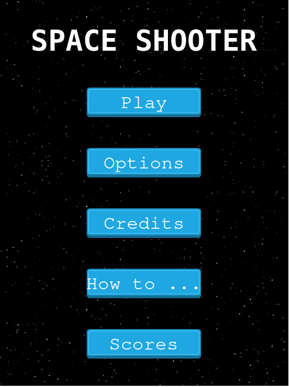

# Space Shooter

## Game Topic

Humanity is under attack by space creatures and it needs you and only you to save it

## Game Rules

- You miss a shot, you lose 2 points.

- You don't kill an enemy, you lose 10 points.

- If your score is negative, you die.

## Demo

  

  

  

  

  

  

## [Youtube Video](https://www.youtube.com/watch?v=0E-0bb0-IFU)

## [Live version](https://ivanderlich-space-shooter.netlify.app/)

## Objective of the game

- Increase your score by:

  - Killing enemies

  - Avoiding:

    - Missing shots

    - Enemies crossing the bottom line

    - Being killed with a bad score.

In other words:

- Ascent to glory over other lesser players that don't gather as much score than you.

## Game mechanics

- Shooting enemies in space

## Levels

It only has one level and it ends when the player dies.

## Entities involved in the game

- Player and its lasers: 

- Enemies:

     - Carrier Ship:

     - Chaser Ship:

     - Gunship and its lasers:

## User interactions:

The user interacts with a player ship by using the w, a,s,d keys and spacebar to shoot.

## Game Scenes

- Instructions.

- Credits.

- Game Over.

- Loading.

- Menu.

- Options.

- Play.

- Score Board.

- Set Score.

## Instalation

Download the repo:

     git clone git@github.com:IvanDerlich/space-shooter-game.git

Move to the folder you had just created:

     cd space-shooter-game

Install project dependencies:

     npm install

Build the project using a node script:

     npm start

## [Future features](https://github.com/IvanDerlich/space-shooter-game/issues?q=is%3Aissue+is%3Aopen+label%3Aenhancement)

## [Report a bug](https://github.com/IvanDerlich/space-shooter-game/issues/new)

## Development Process

I made this game following [This](https://www.notion.so/Shooter-game-203e819041c7486bb36f9e65faecba27) guide.

## Acknowledgments

 - Microverse.

 - The people that created the technologies I'm using listed below.

 - Code reviewers

## Technologies used

 - Webpack

 - NPM

 - [Phaser](https://phaser.io/)

## Author

[Ivan Derlich](https://www.ivanderlich.com).