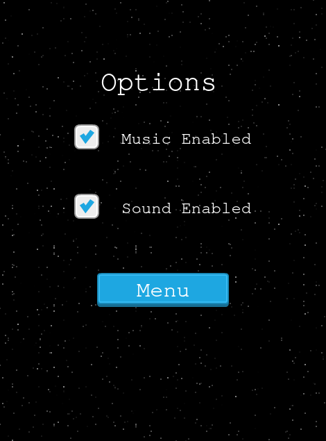
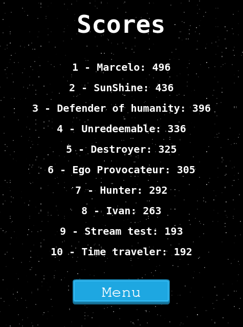
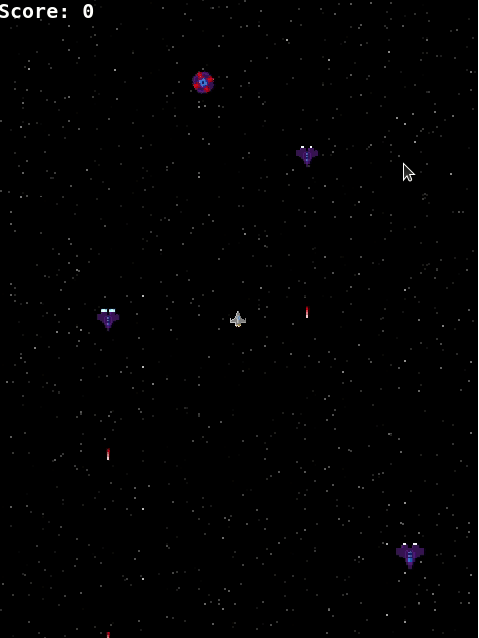

# Space Shooter

Humanity is under attack by space creatures and it needs you and only you to save it

## Demo

  
  
  
  
  
  

## [Youtube Video](https://www.youtube.com/watch?v=0E-0bb0-IFU)

## [Live version](http://ivanderlich-space-shooter-game.surge.sh/)

## Instalation

Download the repo:

      git clone git@github.com:IvanDerlich/space-shooter-game.git

Move to the folder you had just created:

      cd space-shooter-game
      
Install project dependencies:

      npm install
      
Build the project using a node script:

      npm start

## [Future features](https://github.com/IvanDerlich/space-shooter-game/issues?q=is%3Aissue+is%3Aopen+label%3Aenhancement)

## [Report a bug](https://github.com/IvanDerlich/space-shooter-game/issues/new)

## Development Process

This game was made following [This](https://www.notion.so/Shooter-game-203e819041c7486bb36f9e65faecba27) guide.

## Ackowledgments

  - Microverse.
  - The people that created the technologies I'm using listed below.

## Technologies used

  - Webpack
  - NPM
  - [Phaser](https://phaser.io/)

## Author

[Ivan Derlich](https://www.ivanderlich.com).
